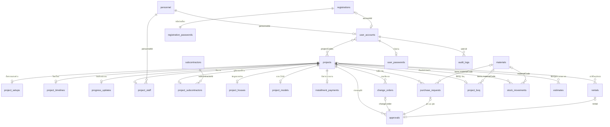
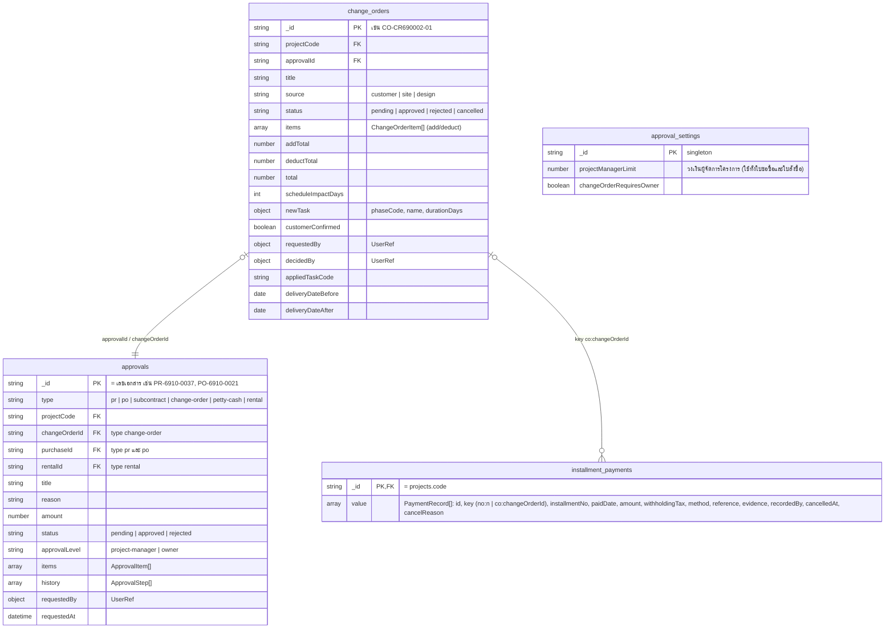
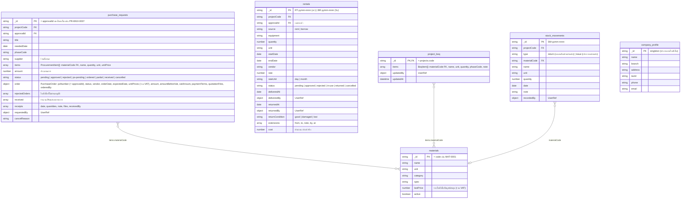
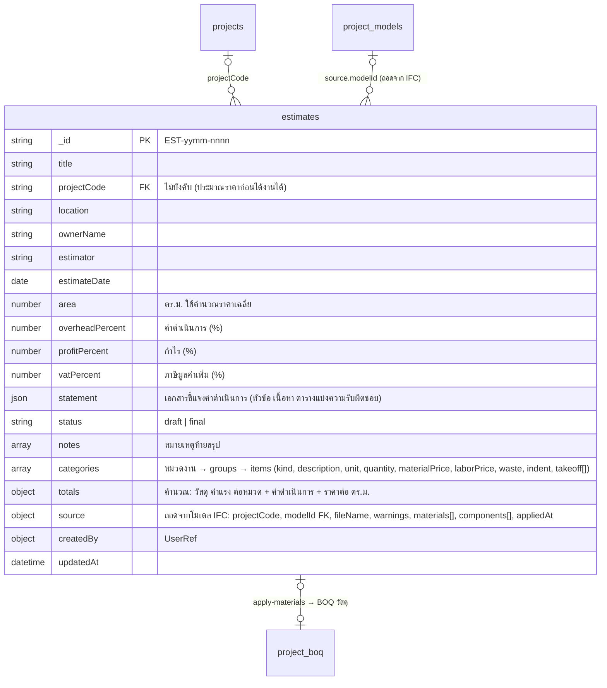
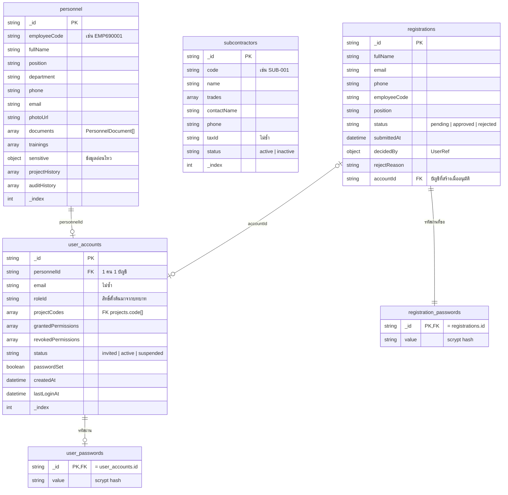
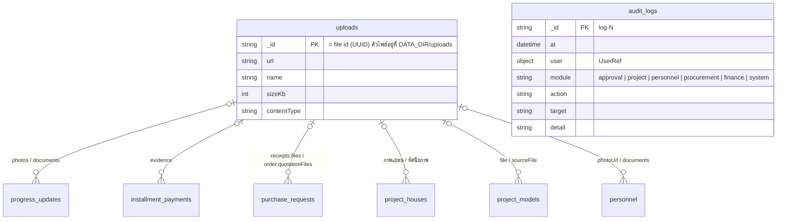

# ER Diagram — ฐานข้อมูลหลังบ้าน (MongoDB)

สร้างจากโค้ดใน `src/domain/` ที่ลงทะเบียนด้วย `persistArray` / `persistMap` / `persistObject` (`src/db/state.ts`) — ทั้งหมด 27 collection

- MongoDB ไม่บังคับ foreign key ความสัมพันธ์ด้านล่างเป็นการอ้างอิงด้วยรหัสในโค้ด
- collection แบบ `persistMap` เก็บเป็น `{ _id: key, value }` เช่น `progress_updates` มี 1 เอกสารต่อโครงการ เก็บบันทึกทั้งหมดเป็นอาร์เรย์ใน `value`
- `UserRef` (`requestedBy`, `decidedBy`, `author`, `user` ฯลฯ) เป็นสำเนา `{ id, name, roleLabel }` ณ เวลาที่เกิดเหตุการณ์ ไม่ได้ join กลับ
- ช่องที่เขียนว่า "คำนวณ" ไม่ได้เก็บใน DB หลังบ้านคำนวณตอนตอบ API

## 1. ภาพรวมความสัมพันธ์

`approval_settings`, `company_profile` เป็นเอกสารเดียว (singleton) ไม่ผูกกับตารางอื่น · `uploads` ถูกอ้างอิงจากหลายตาราง (ดูหัวข้อ 6)

## 2. โครงการและแผนงาน

```mermaid
erDiagram
    projects {
        string _id PK "= code เช่น CR690001 (ภูมิภาค + ปี พ.ศ. + ลำดับ)"
        string name
        string customerName
        string phone
        string customerEmail
        string customerLineId
        string customerAddress
        string responsibleName
        string housePlanName "ตั้งจาก designBrief ถ้าไม่ระบุ เช่น บ้าน 2 ชั้น 3 ห้องนอน (รอออกแบบ)"
        string housePlanCode "แบบในคลัง (โครงการเดิม)"
        object designBrief "floors, bedrooms, bathrooms, parking, usableArea, landArea, budget, style, rooms[]"
        string requirements "รายละเอียดเพิ่มเติมของลูกค้า"
        object siteCoordinates "lat, lng, updatedBy, updatedAt (หมุดแผนที่/นำทาง Google Maps)"
        number value "null จนกว่าจะบันทึกสัญญา"
        date contractSignedAt
        date startDate
        date deliveryDate
        string location "ที่ตั้งหน้างาน (บันทึกตอนทำสัญญา)"
        int progress
        string status "pending-contract | planning | in-progress | delayed | completed (คำนวณ)"
        datetime createdAt
        date handedOverAt
        number changeOrderTotal
        number revisedValue "คำนวณ: value + changeOrderTotal"
        array warranties "คำนวณ: สถาปัตย์ 1 ปี โครงสร้าง 5 ปี นับจากส่งมอบ"
        int _index
    }

    project_setups {
        string _id PK,FK "= projects.code"
        datetime configuredAt "value.*"
        string configuredBy
        object options "buildingType, floors (บ้าน 1-3 / พาณิชย์ 1-8), foundation ฯลฯ"
        array excludedTasks "รหัสงานที่ตัดออก"
        array customTasks "CustomTaskInput[]"
        array paymentPercents "สัดส่วนงวดเงิน (%)"
    }

    project_timelines {
        string _id PK,FK "= projects.code"
        int progress "value.*"
        array phases "TimelinePhase[] ซ้อน tasks[] (code ชั้น 3+ ต่อท้าย -ชั้น เช่น 06.09-3)"
        date tasks_startedOn "คำนวณ: บันทึกหน้างานครั้งแรกของงาน"
        date tasks_lastUpdatedOn "คำนวณ: บันทึกหน้างาน/ผลตรวจล่าสุด"
    }

    progress_updates {
        string _id PK,FK "= projects.code"
        array value "ProgressUpdate[]: id, reportDate, author, weather, workers, taskChanges[taskCode], inspection, issues, photos, documents, overallProgress"
    }

    project_staff {
        string _id PK,FK "= projects.code"
        array value "StoredStaff[]: id, personnelId FK, role, note"
    }

    project_subcontractors {
        string _id PK,FK "= projects.code"
        array value "StoredSub[]: id, subcontractorId FK, scope, phaseCodes, contractValue, note"
    }

    project_houses {
        string _id PK,FK "= projects.code"
        object value "name, description, usableArea, width, depth, floors, bedrooms, bathrooms, kitchens, parking, floorPlans[label,image], renders{front,back,left,right}"
    }

    project_models {
        string _id PK,FK "= projects.code"
        array value "ProjectModel[]: id, version, title, sourceApp, format, file, sourceFile (.skp/.ifc), elements, conversion, upAxis, uploadedBy, uploadedAt, deletedAt"
    }

    projects ||--o| project_setups : "ตั้งค่า"
    projects ||--o| project_timelines : "ไทม์ไลน์"
    projects ||--o| progress_updates : "บันทึกหน้างาน"
    progress_updates }o--o{ project_timelines : "taskChanges.taskCode"
    projects ||--o| project_staff : "ทีมงาน"
    projects ||--o| project_subcontractors : "ผู้รับเหมา"
    projects ||--o| project_houses : "แบบบ้าน"
    projects ||--o| project_models : "แบบ 3 มิติ"
```

## 3. การเงิน งานเพิ่ม-ลด และการอนุมัติ

## 4. จัดซื้อ เช่า วัสดุ และคลัง

การใช้วัสดุจริงของโครงการ (`GET /projects/{code}/material-usage`) คำนวณจาก `purchase_requests.received` + `stock_movements` (issue − return) เทียบ `project_boq` · ยอดคงเหลือคลังหลัก (`GET /warehouse/stock`) คำนวณจาก `stock_movements` ทั้งหมด

## 4.1 ถอดปริมาณและ BOQ (ประมาณราคา)

ถอดจากโมเดล IFC (`POST /estimates/from-model`): อ่านไฟล์ต้นฉบับ .ifc ของแบบ 3 มิติใน worker thread (`src/convert/ifc-takeoff.ts`) แล้วจัดเป็นรายการ BOQ + รายการวัสดุ (`src/domain/estimate-from-ifc.ts`) — ชนิดงานตัดสินจากประเภท IFC + ชื่อชนิด + วัสดุ ปริมาณจาก BaseQuantities หรือรูปทรง

ปริมาณของรายการที่มีบรรทัดถอด (`takeoff`: volume, area, length, count, rebar, steel พร้อมบรรทัดหัก) = ผลรวม × (1 + เผื่อเสีย%) หลังบ้านคำนวณใหม่ทุกครั้งที่บันทึก · คลังราคาต่อหน่วย (`GET /estimate-rates`) รวบรวมจากรายการใน BOQ ทุกฉบับ

## 5. บุคลากร ผู้ใช้ และการสมัคร

สิทธิ์ (permission) มาจากบทบาทใน `src/domain/roles.ts` (ไม่เก็บใน DB) ปรับรายคนได้ด้วย `grantedPermissions` / `revokedPermissions` เช่น `procurement.manage` (ฝ่ายจัดซื้อ) และ `procurement.receive` (เจ้าของ ผู้จัดการโครงการ วิศวกร โฟร์แมน ตรวจรับของ)

## 6. ไฟล์และบันทึกการใช้งาน

## สรุป collection

| กลุ่ม | collection | รูปแบบ | คีย์ (`_id`) |
|---|---|---|---|
| โครงการ | `projects` | array | รหัสโครงการ |
| | `project_setups`, `project_timelines`, `progress_updates`, `project_staff`, `project_subcontractors` | map | รหัสโครงการ |
| | `project_houses`, `project_models` | map | รหัสโครงการ |
| การเงิน | `installment_payments` | map | รหัสโครงการ (รวมรายการที่ยกเลิก) |
| | `change_orders` | array | รหัสงานเพิ่ม-ลด |
| การอนุมัติ | `approvals` | array | เลขเอกสาร |
| | `approval_settings` | object | `singleton` |
| จัดซื้อ/เช่า | `purchase_requests` | array | เลขใบขอซื้อ (= เลขคำขออนุมัติ) |
| | `rentals` | array | เลขเช่า/ยืม |
| วัสดุและคลัง | `materials` | array | รหัสวัสดุ |
| | `project_boq` | map | รหัสโครงการ |
| | `stock_movements` | array | เลขรายการคลัง |
| | `company_profile` | object | `singleton` |
| ประมาณราคา | `estimates` | array | เลข BOQ |
| บุคลากร | `personnel`, `subcontractors` | array | id |
| ผู้ใช้ | `user_accounts` | array | id |
| | `user_passwords` | map | id บัญชี |
| สมัครสมาชิก | `registrations` | array (ล่าสุดก่อน) | id |
| | `registration_passwords` | map | id คำขอสมัคร |
| อื่น ๆ | `uploads` | map | id ไฟล์ |
| | `audit_logs` | array (ล่าสุดก่อน) | `log-N` |
