# ER Diagram — ฐานข้อมูลหลังบ้าน (MongoDB)

สร้างจากโค้ดใน `src/domain/` ที่ลงทะเบียนด้วย `persistArray` / `persistMap` / `persistObject` (`src/db/state.ts`)

- MongoDB ไม่บังคับ foreign key ความสัมพันธ์ด้านล่างเป็นการอ้างอิงด้วยรหัสในโค้ด
- collection ที่มาจาก `persistMap` เก็บเป็น `{ _id: key, value }` เช่น `progress_updates` มี 1 เอกสารต่อโครงการ และเก็บบันทึกทั้งหมดเป็นอาร์เรย์ใน `value`
- `UserRef` (`requestedBy`, `decidedBy`, `author`, `user`) เป็นสำเนา `{ id, name, roleLabel }` ณ เวลาที่เกิดเหตุการณ์ ไม่ได้ join กลับ

```mermaid
erDiagram
    projects {
        string _id PK "= code เช่น CR690001"
        string name
        string customerName
        string phone
        string responsibleName
        string housePlanName
        string housePlanCode "แบบบ้านในโค้ด (ไม่อยู่ใน DB)"
        number value "null จนกว่าจะบันทึกสัญญา"
        date startDate
        date deliveryDate
        date contractSignedAt
        string location
        int progress
        string status
        datetime createdAt
        datetime setupConfiguredAt
        date handedOverAt
        date warrantyUntil "คำนวณ: ส่งมอบ + 5 ปี (งานโครงสร้าง) ไม่เก็บใน DB"
        number changeOrderTotal
        number revisedValue
        int _index
    }

    project_setups {
        string _id PK,FK "= projects.code"
        datetime configuredAt "value.*"
        string configuredBy
        object options "ตัวเลือกงานก่อสร้าง"
        array excludedTasks "รหัสงานที่ตัดออก"
        array customTasks "CustomTaskInput[]"
        array paymentPercents "สัดส่วนงวดเงิน (%) ไม่มี = ค่าตั้งต้น"
    }

    project_timelines {
        string _id PK,FK "= projects.code"
        int progress "value.*"
        array phases "TimelinePhase[] ซ้อน tasks[]"
    }

    progress_updates {
        string _id PK,FK "= projects.code"
        array value "ProgressUpdate[] (id, reportDate, author, weather, workers, taskChanges, inspection, issues, photos, documents, overallProgress)"
    }

    project_staff {
        string _id PK,FK "= projects.code"
        array value "StoredStaff[]: id, personnelId FK, role, note"
    }

    project_subcontractors {
        string _id PK,FK "= projects.code"
        array value "StoredSub[]: id, subcontractorId FK, scope, phaseCodes, contractValue, note"
    }

    change_orders {
        string _id PK "= id เช่น CO-CR690002-01"
        string projectCode FK
        string approvalId FK
        string title
        string source "customer | site | design"
        string status "pending | approved | rejected | cancelled"
        array items "ChangeOrderItem[]"
        number addTotal
        number deductTotal
        number total
        int scheduleImpactDays
        object newTask
        boolean customerConfirmed
        object requestedBy "UserRef"
        datetime requestedAt
        object decidedBy "UserRef"
        datetime decidedAt
        string appliedTaskCode "งานที่เพิ่มในไทม์ไลน์"
        date deliveryDateBefore
        date deliveryDateAfter
    }

    project_houses {
        string _id PK,FK "= projects.code"
        object value "name, description, usableArea, width, depth, floors, bedrooms, bathrooms, kitchens, parking, floorPlans[label,image], renders{front,back,left,right}, updatedBy, updatedAt"
    }

    project_models {
        string _id PK,FK "= projects.code"
        array value "ProjectModel[]: id, version, title, sourceApp (sketchup|revit|other), format (glb|gltf|dae|fbx|obj), file, sourceFile (.skp/.rvt/.ifc), elements (ข้อมูลชิ้นงาน IFC), conversion, upAxis, note, uploadedBy, uploadedAt, deletedAt, deletedBy"
    }

    installment_payments {
        string _id PK,FK "= projects.code"
        array value "PaymentRecord[]: id, key (no:n | co:changeOrderId), installmentNo, paidDate, amount, withholdingTax, method, reference, note, evidence (UploadedFile[]), recordedBy, recordedAt, cancelledAt, cancelledBy, cancelReason"
    }

    purchase_requests {
        string _id PK "= id = approvalId เช่น PR-6910-0001"
        string projectCode FK
        string approvalId FK
        string title
        date neededDate
        string phaseCode "ขั้นตอนในไทม์ไลน์ (ไม่บังคับ)"
        string supplier "ร้านที่เสนอ"
        array items "ProcurementItem[]: name, quantity, unit, unitPrice"
        number amount
        string status "pending | approved | rejected | ordered | partial | received | cancelled"
        object order "supplier, poNumber, orderDate, expectedDate, orderedBy"
        array received "จำนวนที่รับแล้วต่อรายการ"
        array receipts "PurchaseReceipt[]: date, quantities, note, files (UploadedFile[]), receivedBy"
        object requestedBy "UserRef"
        string cancelReason
    }

    rentals {
        string _id PK "RT-yymm-nnnn (เช่า) | BR-yymm-nnnn (ยืม)"
        string projectCode FK
        string approvalId FK "เฉพาะเช่า"
        string source "rent | borrow"
        string equipment
        number quantity
        string unit
        date startDate
        date endDate
        string vendor
        number rate
        string rateUnit "day | month"
        string status "pending | approved | rejected | in-use | returned | cancelled"
        date deliveredAt
        date returnedAt
        string returnCondition "good | damaged | lost"
        array extensions "from, to, note, by (UserRef), at"
        object deliveredBy "UserRef"
        string deliveryNote
        object returnedBy "UserRef"
        object requestedBy "UserRef"
    }

    approvals {
        string _id PK "= id"
        string type "pr | po | subcontract | change-order | petty-cash | rental"
        string projectCode FK
        string changeOrderId FK "เฉพาะ type = change-order"
        string purchaseId FK "เฉพาะ type = pr"
        string rentalId FK "เฉพาะ type = rental"
        string title
        string reason
        number amount
        string status "pending | approved | rejected"
        string approvalLevel "project-manager | owner"
        array items "ApprovalItem[]"
        array history "ApprovalStep[]"
        object requestedBy "UserRef"
        datetime requestedAt
    }

    approval_settings {
        string _id PK "= singleton"
        number projectManagerLimit
        boolean changeOrderRequiresOwner
    }

    personnel {
        string _id PK "= id"
        string employeeCode "เช่น EMP690001"
        string fullName
        string position
        string department
        string phone
        string email
        string photoUrl "ลิงก์จาก uploads"
        array documents "PersonnelDocument[] (url จาก uploads)"
        array trainings
        object sensitive "ข้อมูลอ่อนไหว"
        array projectHistory
        array auditHistory
        int _index
    }

    subcontractors {
        string _id PK "= id"
        string code "เช่น SUB-001"
        string name
        array trades
        string contactName
        string phone
        string taxId "ไม่ซ้ำ"
        string status "active | inactive"
        int _index
    }

    user_accounts {
        string _id PK "= id"
        string personnelId FK "1 คน 1 บัญชี"
        string email "ไม่ซ้ำ"
        string roleId
        array projectCodes "FK -> projects.code[]"
        array grantedPermissions
        array revokedPermissions
        string status "invited | active | suspended"
        boolean passwordSet
        datetime createdAt
        datetime invitedAt
        datetime lastLoginAt
        int _index
    }

    user_passwords {
        string _id PK,FK "= user_accounts.id"
        string value "scrypt hash"
    }

    registrations {
        string _id PK "= id"
        string fullName
        string email
        string phone
        string employeeCode
        string position
        string note
        string status "pending | approved | rejected"
        datetime submittedAt
        object decidedBy "UserRef"
        datetime decidedAt
        string rejectReason
        string accountId FK "บัญชีที่สร้างเมื่ออนุมัติ"
    }

    registration_passwords {
        string _id PK,FK "= registrations.id"
        string value "scrypt hash"
    }

    uploads {
        string _id PK "= file id (UUID)"
        string id "value.*"
        string url
        string name
        int sizeKb
        string contentType
    }

    audit_logs {
        string _id PK "= id เช่น log-12"
        datetime at
        object user "UserRef (id -> user_accounts)"
        string module
        string action
        string target "รหัสสิ่งที่ถูกกระทำ"
        string detail
    }

    projects ||--o| project_setups : "ตั้งค่างานก่อสร้าง"
    projects ||--o| project_timelines : "ไทม์ไลน์"
    projects ||--o| progress_updates : "บันทึกหน้างาน"
    projects ||--o| project_staff : "ทีมงาน"
    projects ||--o| project_subcontractors : "ผู้รับเหมาที่จ้าง"
    projects ||--o| installment_payments : "รับชำระงวดงาน"
    projects ||--o| project_houses : "ข้อมูลแบบบ้าน"
    uploads |o--o{ project_houses : "ภาพแปลน / ทัศนียภาพ"
    projects ||--o| project_models : "แบบบ้าน 3 มิติ (ทุกเวอร์ชัน)"
    uploads |o--o{ project_models : "file / sourceFile"
    projects ||--o{ change_orders : "งานเพิ่ม-ลด"
    projects ||--o{ approvals : "คำขออนุมัติ"
    change_orders |o--|| approvals : "approvalId / changeOrderId"
    projects ||--o{ purchase_requests : "จัดซื้อวัสดุ"
    projects ||--o{ rentals : "เช่า/ยืมอุปกรณ์"
    purchase_requests |o--|| approvals : "approvalId / purchaseId"
    rentals |o--o| approvals : "approvalId / rentalId (เฉพาะเช่า)"
    purchase_requests }o--o{ uploads : "receipts.files"
    personnel ||--o{ project_staff : "personnelId"
    subcontractors ||--o{ project_subcontractors : "subcontractorId"
    personnel ||--o| user_accounts : "personnelId"
    user_accounts }o--o{ projects : "projectCodes"
    user_accounts ||--o| user_passwords : "รหัสผ่าน"
    registrations ||--|| registration_passwords : "รหัสผ่านที่ขอ"
    registrations |o--o| user_accounts : "accountId"
    uploads |o--o{ progress_updates : "photos / documents"
    uploads |o--o{ personnel : "photoUrl / documents"
    uploads |o--o{ installment_payments : "evidence"
    change_orders |o--o{ installment_payments : "key co:changeOrderId"
    user_accounts ||--o{ audit_logs : "user.id"
```

## สรุป collection

| กลุ่ม | collection | รูปแบบ | คีย์ (`_id`) |
|---|---|---|---|
| โครงการ | `projects` | array | รหัสโครงการ |
| | `project_setups`, `project_timelines`, `progress_updates`, `project_staff`, `project_subcontractors` | map | รหัสโครงการ |
| | `change_orders` | array | รหัสงานเพิ่ม-ลด |
| | `installment_payments` | map | รหัสโครงการ (รายการรับชำระพร้อมหลักฐาน รวมรายการที่ยกเลิก) |
| | `project_models` | map | รหัสโครงการ (แบบ 3 มิติทุกเวอร์ชัน รวมเวอร์ชันที่ลบแล้ว) |
| | `project_houses` | map | รหัสโครงการ (ข้อมูลแบบบ้านที่ผู้ตั้งค่ากรอก ภาพแปลนรายชั้น ทัศนียภาพ 4 มุม) |
| | `purchase_requests` | array | รหัสใบขอซื้อ (= รหัสคำขออนุมัติ) |
| | `rentals` | array | รหัสเช่า/ยืม |
| การอนุมัติ | `approvals` | array | รหัสคำขอ |
| | `approval_settings` | object | `singleton` |
| บุคลากร | `personnel`, `subcontractors` | array | id |
| ผู้ใช้ | `user_accounts` | array | id |
| | `user_passwords` | map | id บัญชี |
| สมัครสมาชิก | `registrations` | array (เรียงล่าสุดก่อน) | id |
| | `registration_passwords` | map | id คำขอสมัคร |
| อื่น ๆ | `uploads` | map | id ไฟล์ (ตัวไฟล์อยู่ที่ `DATA_DIR/uploads`) |
| | `audit_logs` | array (เรียงล่าสุดก่อน) | `log-N` |
